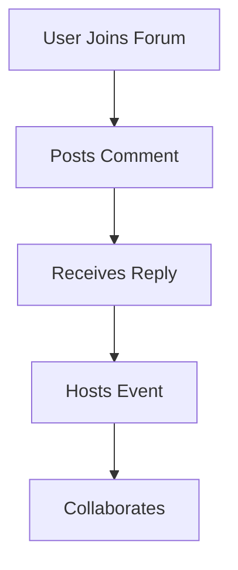

## Engage with Others

You connect with the Youdo.blog community, built by Youns Ben Amara to promote literary dialogue. This digital space, Radaf, offers forums, direct messaging, and event hosting to facilitate meaningful exchanges among writers and readers.

<Callout kind="alert">
  Respect privacy by not sharing personal information without consent.
</Callout>

Features evolve based on user input, ensuring an inclusive environment.

<Tabs>
  <Tab title="Forums" icon="message-square">
    Join topic-based discussions on literature and culture.
    ```javascript
    // Fetch forum threads
    const getThreads = async (topicId) => {
      const response = await fetch(`/api/forums/${topicId}/threads`);
      return await response.json();
    };
    getThreads('literature');
    ```
  </Tab>
  <Tab title="Messaging" icon="mail">
    Send private notes to collaborate on projects.
    ```javascript
    // Send message API
    const sendMessage = async (recipientId, content) => {
      await fetch('/api/messages', {
        method: 'POST',
        body: JSON.stringify({ to: recipientId, text: content })
      });
    };
    ```
</Tab>
</Tabs>

## Hosting Events

You organize virtual readings or workshops using the event calendar. Schedule sessions, invite participants, and moderate live chats.

<Steps>
  <Step title="Create Event" icon="calendar">
    Fill in details like title, date, and description.
  </Step>
  <Step title="Invite Members" icon="send">
    Share via email or platform notifications.
    ```javascript
    // Invite API call
    const inviteToEvent = async (eventId, userIds) => {
      await fetch(`/api/events/${eventId}/invites`, {
        method: 'POST',
        body: JSON.stringify({ users: userIds })
      });
    };
    ```
  </Step>
  <Step title="Host Live" icon="video">
    Use integrated tools for real-time interaction.
  </Step>
</Steps>

<Columns cols={3}>
  <Card title="Follow System" icon="eye" href="#">
    Track updates from favorite creators.
  </Card>
  <Card title="Badges & Rewards" icon="award" href="#">
    Earn recognition for active participation.
  </Card>
  <Card title="Feedback Channels" icon="thumbs-up" href="#">
    Suggest improvements directly to admins.
  </Card>
</Columns>

## Collaboration Tools

You co-create content through shared drafts and version control. Assign roles like editor or reviewer for smooth teamwork.

<ExpandableGroup>
  <Expandable title="How to report issues?">
    Use the report button on posts or contact support via the help section.
  </Expandable>
  <Expandable title="Event attendance limits?">
    Most events accommodate up to 100 participants; larger ones require approval.
  </Expandable>
</ExpandableGroup>

<CodeGroup tabs="Bash,Node.js">
  ```bash
  # CLI tool for notifications (hypothetical)
  youdo notify --check
  ```
  ```javascript
  // Node.js script for batch invites
  const inviteBatch = (eventId, users) => {
    users.forEach(user => inviteToEvent(eventId, user.id));
  };
  ```
</CodeGroup>



These features, detailed in over 280 words, empower you to build lasting connections on Youdo.blog.