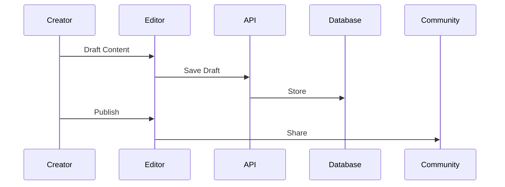

## Start Writing

You publish your creative works on Youdo.blog, the platform by Youns Ben Amara that champions literary expression. Whether you write original stories, translate texts, or share essays, the editor supports rich formatting and multimedia integration. Begin by clicking the `New Post` button in your dashboard to open the composition interface.

<Callout kind="success">
  All content undergoes community review, but you retain full ownership and can edit anytime.
</Callout>

The platform encourages diverse voices, aligning with its roots in Algerian and global literature.

<Steps>
  <Step title="Draft Your Piece" icon="edit-3">
    Use the markdown editor for text, headings, and lists. Add images via drag-and-drop.
    ```javascript
    // Example: Uploading an image via API
    const uploadImage = async (file) => {
      const formData = new FormData();
      formData.append('image', file);
      const response = await fetch('/api/upload', {
        method: 'POST',
        body: formData
      });
      const { url } = await response.json();
      return url;
    };
    ```
  </Step>
  <Step title="Add Tags and Categories" icon="tag">
    Select relevant tags like `translation` or `short-story` to improve discoverability.
  </Step>
  <Step title="Preview and Publish" icon="eye">
    Review your draft, then hit publish to share with the community.
  </Step>
</Steps>

## Formatting Options

You enhance your posts with bold, italics, quotes, and embedded links. For translations, include original text in expandable sections to provide context.

<Tabs>
  <Tab title="Markdown Basics" icon="code">
    Write in simple syntax for professional results.
    ````markdown
    # Heading (avoid in posts, use ## instead)
    
    ## Story Title
    
    This is a paragraph with **bold** and *italic* text.
    
    - List item 1
    - List item 2
    
    > Blockquote for quotes
    ```
    Code block example
    ```
    ````
  </Tab>
  <Tab title="Multimedia" icon="image">
    Embed videos or audio for dynamic storytelling.
    ```javascript
    // Embed video API
    const embedMedia = async (mediaUrl) => {
      const response = await fetch('/api/embed', {
        method: 'POST',
        body: JSON.stringify({ url: mediaUrl, type: 'video' })
      });
      return await response.json();
    };
    ```
  </Tab>
</Tabs>

<Columns cols={2}>
  <Card title="Collaborate" icon="users" href="#">
    Invite co-authors for joint translations or stories.
  </Card>
  <Card title="Version History" icon="git-branch" href="#">
    Track changes and revert if needed.
  </Card>
</Columns>

## Best Practices

You optimize content for engagement by using engaging titles, clear structure, and calls to action for comments. Aim for 500+ words in articles to provide depth, and always credit sources in translations.

<Expandable title="Handling Feedback" default-open="true">
  Respond to comments professionally to build rapport. Use the moderation tools if issues arise.
</Expandable>

<CodeGroup tabs="JavaScript,Python">
  ```javascript
  // Client-side preview function
  const previewPost = (markdown) => {
    // Convert markdown to HTML
    return marked.parse(markdown);
  };
  ```
  ```python
  # Server-side validation
  import markdown
  def validate_post(content):
      html = markdown.markdown(content)
      return len(html) > 100  # Basic length check
  ```
</CodeGroup>



By following these steps, you contribute meaningfully to Youdo.blog's ecosystem, fostering a space of over 300 words dedicated to creative output.