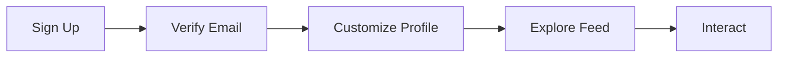

## Account Creation

You create your Youdo.blog account quickly to join the digital community founded by Youns Ben Amara. This platform, known as Radaf, welcomes writers, readers, and creators worldwide. Start by visiting the homepage and selecting the sign-up option, where you provide basic information like email and a preferred username.

<Callout kind="tip">
  Choose a username that reflects your creative identity, as it appears in community interactions.
</Callout>

The registration process verifies your email to prevent spam and ensures secure access from the outset.

<Steps>
  <Step title="Register" icon="user-plus">
    Enter your email, create a password, and select interests such as literature or translation.
    ```javascript
    // Simulated registration API call
    const registerUser = async (email, password) => {
      const response = await fetch('/api/register', {
        method: 'POST',
        headers: { 'Content-Type': 'application/json' },
        body: JSON.stringify({ email, password, interests: ['literature', 'translation'] })
      });
      if (response.ok) {
        console.log('Registration successful');
      }
    };
    registerUser('your@email.com', 'strongpassword');
    ```
  </Step>
  <Step title="Verify Email" icon="mail">
    Check your inbox for a confirmation link and click it to activate your account.
  </Step>
  <Step title="Profile Setup" icon="settings">
    Add a bio, profile picture, and link to your social media for better community connections.
  </Step>
</Steps>

## Navigating the Dashboard

Once logged in, you access the dashboard, which organizes content into sections like feeds, posts, and discussions. Customize your feed by following topics or users to receive tailored recommendations.

<Tabs>
  <Tab title="Feed View" icon="rss">
    Scroll through curated posts from followed creators.
    ```javascript
    // Fetch personalized feed
    const getFeed = async () => {
      const response = await fetch('/api/feed?userId=123');
      const feed = await response.json();
      feed.forEach(post => console.log(post.title));
    };
    ```
  </Tab>
  <Tab title="Search" icon="search">
    Use keywords to find specific content, such as `Algerian literature`.
    ```javascript
    // Search API example
    const searchContent = async (query) => {
      const response = await fetch(`/api/search?q=${encodeURIComponent(query)}`);
      return await response.json();
    };
    searchContent('Ben Amara translations');
    ```
</Tab>
</Tabs>

<Columns cols={2}>
  <Card title="Follow Users" icon="users" href="#">
    Search for creators like Youns Ben Amara and follow to see their updates in your feed.
  </Card>
  <Card title="Bookmark Posts" icon="bookmark" href="#">
    Save articles for later reading; access them from your personal library.
  </Card>
</Columns>

## First Interactions

You engage by commenting on posts or starting a discussion thread. The platform moderates content to maintain a positive atmosphere, so review guidelines before posting.

<ExpandableGroup>
  <Expandable title="What if I forget my password?" default-open="false">
    Use the forgot password link on the login page. Enter your email to receive a reset link valid for 24 hours.
  </Expandable>
  <Expandable title="How do notifications work?">
    Enable email or in-app alerts for replies, mentions, or new posts from follows.
  </Expandable>
</ExpandableGroup>



This guide prepares you to fully utilize Youdo.blog. With over 250 words of practical advice, you now understand the essentials for a rewarding experience in this creative community.