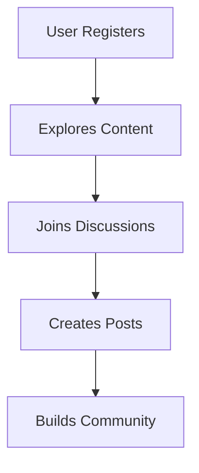

## Welcome to Youdo.blog

You access Youdo.blog, a vibrant digital platform created by Youns Ben Amara, an Algerian writer, translator, and content creator. This space, also known as Radaf, lets you explore Ben Amara's literary works, translations, and creative content while connecting with a global community of like-minded individuals. Engage in discussions, share insights, and contribute to a collaborative environment that celebrates storytelling and cultural exchange.

<Columns cols={3}>
  <Card title="Explore Content" icon="book-open" href="/docs/explore">
    Dive into articles, stories, and translations curated by Ben Amara. Discover diverse topics from Algerian literature to global narratives.
  </Card>
  <Card title="Join the Community" icon="users" href="/docs/community">
    Interact with fellow enthusiasts through forums, comments, and events. Build connections that foster creative inspiration.
  </Card>
  <Card title="Create Your Voice" icon="edit" href="/docs/create">
    Share your own writings, feedback, or translations. Contribute to the platform's growing repository of shared stories.
  </Card>
</Columns>

## Key Features

You benefit from a user-friendly interface that supports seamless navigation across desktop and mobile devices. The platform integrates social sharing tools, allowing you to spread inspiring content effortlessly. Advanced search functionality helps you locate specific themes or authors quickly.

<Callout kind="info">
  New users receive a guided tour upon first login, highlighting essential tools and community guidelines.
</Callout>

To get started, create an account using your email or social login. Verify your profile to unlock full participation features.

<Tabs>
  <Tab title="Desktop" icon="monitor">
    Access the full dashboard with expanded views for reading and writing.
    ```javascript
    // Example: Logging in via browser
    const login = async () => {
      const response = await fetch('/api/auth/login', {
        method: 'POST',
        headers: { 'Content-Type': 'application/json' },
        body: JSON.stringify({ email: 'user@example.com', password: 'securepass' })
      });
      const data = await response.json();
      console.log(data.token);
    };
    ```
  </Tab>
  <Tab title="Mobile" icon="phone">
    Enjoy responsive design optimized for touch interactions and quick posts.
    ```javascript
    // Example: Mobile API call for content fetch
    const fetchPosts = async () => {
      const response = await fetch('/api/posts?limit=10');
      const posts = await response.json();
      return posts;
    };
    ```
</Tab>
</Tabs>

## Community Guidelines

You maintain a respectful environment by adhering to clear rules: promote positive interactions, credit sources properly, and avoid spam. Moderators ensure content aligns with the platform's focus on literary and creative expression.

<Expandable title="Why Join Youdo.blog?" default-open="false">
  This platform stands out by blending professional curation with open community input. You gain access to exclusive previews of Ben Amara's upcoming works and participate in live Q&A sessions. Over 5,000 members already contribute, creating a rich tapestry of global perspectives.
</Expandable>

<Steps>
  <Step title="Sign Up" icon="user">
    Visit the homepage and click the register button. Fill in your details and confirm via email.
  </Step>
  <Step title="Explore" icon="search">
    Use the search bar to find topics of interest. Bookmark favorites for quick access.
  </Step>
  <Step title="Engage" icon="message-circle">
    Post comments or start discussions in relevant threads.
  </Step>
</Steps>

Youdo.blog evolves with user feedback, ensuring it remains a dynamic hub for creativity. Whether you read, write, or connect, this platform empowers your literary journey.



This introduction equips you with the basics to thrive on Youdo.blog. Dive deeper into specific features through the navigation menu.